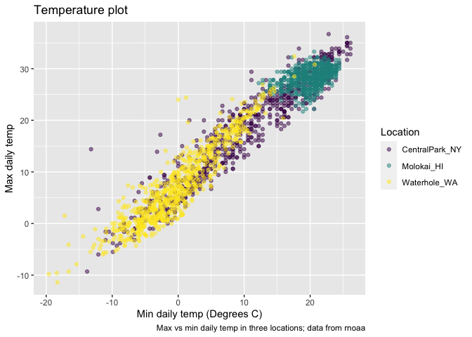
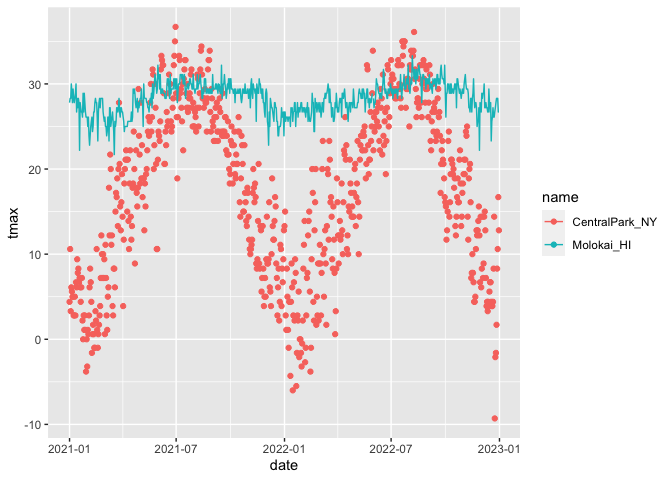

Viz Part 2
================

``` r
library(tidyverse)
```

    ## ── Attaching core tidyverse packages ──────────────────────── tidyverse 2.0.0 ──
    ## ✔ dplyr     1.1.3     ✔ readr     2.1.4
    ## ✔ forcats   1.0.0     ✔ stringr   1.5.0
    ## ✔ ggplot2   3.4.3     ✔ tibble    3.2.1
    ## ✔ lubridate 1.9.2     ✔ tidyr     1.3.0
    ## ✔ purrr     1.0.2     
    ## ── Conflicts ────────────────────────────────────────── tidyverse_conflicts() ──
    ## ✖ dplyr::filter() masks stats::filter()
    ## ✖ dplyr::lag()    masks stats::lag()
    ## ℹ Use the conflicted package (<http://conflicted.r-lib.org/>) to force all conflicts to become errors

``` r
library(ggridges)
library(patchwork)
```

Get the data for plotting today.

``` r
weather_df = 
  rnoaa::meteo_pull_monitors(
    c("USW00094728", "USW00022534", "USS0023B17S"),
    var = c("PRCP", "TMIN", "TMAX"), 
    date_min = "2021-01-01",
    date_max = "2022-12-31") |>
  mutate(
    name = recode(
      id, 
      USW00094728 = "CentralPark_NY", 
      USW00022534 = "Molokai_HI", 
      USS0023B17S = "Waterhole_WA"),
    tmin = tmin / 10,
    tmax = tmax / 10) |>
  select(name, id, everything())
```

    ## using cached file: /Users/laylahjones/Library/Caches/org.R-project.R/R/rnoaa/noaa_ghcnd/USW00094728.dly

    ## date created (size, mb): 2023-09-28 10:44:43.434266 (8.524)

    ## file min/max dates: 1869-01-01 / 2023-09-30

    ## using cached file: /Users/laylahjones/Library/Caches/org.R-project.R/R/rnoaa/noaa_ghcnd/USW00022534.dly

    ## date created (size, mb): 2023-09-28 10:45:14.723595 (3.83)

    ## file min/max dates: 1949-10-01 / 2023-09-30

    ## using cached file: /Users/laylahjones/Library/Caches/org.R-project.R/R/rnoaa/noaa_ghcnd/USS0023B17S.dly

    ## date created (size, mb): 2023-09-28 10:45:22.421728 (0.994)

    ## file min/max dates: 1999-09-01 / 2023-09-30

## Same plot from last time

``` r
weather_df |>
  ggplot(aes(x = tmin, y = tmax, color = name)) +
  geom_point(alpha = .5) +
  labs(
    title = "Temperature plot",
    x = "Min daily temp (Degrees C)",
    y = "Max daily temp",
    color = "Location",
    caption = "Max vs min daily temp in three locations; data from rnoaa"
  )
```

    ## Warning: Removed 17 rows containing missing values (`geom_point()`).

<!-- -->

``` r
weather_df |>
  ggplot(aes(x = tmin, y = tmax, color = name)) +
  geom_point(alpha = .5) +
  labs(
    title = "Temperature plot",
    x = "Min daily temp (Degrees C)",
    y = "Max daily temp",
    color = "Location",
    caption = "Max vs min daily temp in three locations; data from rnoaa"
  ) + 
  scale_x_continuous(
    breaks = c(-15, 0, 15),
    labels = c("-15 C", "0", "15")
  ) + 
  scale_x_continuous(
    position = "right",
  )
```

    ## Scale for x is already present.
    ## Adding another scale for x, which will replace the existing scale.

    ## Warning: Removed 17 rows containing missing values (`geom_point()`).

    ## Warning: Position guide is perpendicular to the intended axis
    ## ℹ Did you mean to specify a different guide `position`?

<!-- -->

## what about colors….

``` r
weather_df |>
  ggplot(aes(x = tmin, y = tmax, color = name)) +
  geom_point(alpha = .5) +
  labs(
    title = "Temperature plot",
    x = "Min daily temp (Degrees C)",
    y = "Max daily temp",
    color = "Location",
    caption = "Max vs min daily temp in three locations; data from rnoaa"
  ) +
  viridis::scale_color_viridis(discrete = TRUE)
```

    ## Warning: Removed 17 rows containing missing values (`geom_point()`).

<!-- -->

## Themes

``` r
weather_df |>
  ggplot(aes(x = tmin, y = tmax, color = name)) +
  geom_point(alpha = .5) +
  labs(
    title = "Temperature plot",
    x = "Min daily temp (Degrees C)",
    y = "Max daily temp",
    color = "Location",
    caption = "Max vs min daily temp in three locations; data from rnoaa"
  ) +
  viridis::scale_color_viridis(discrete = TRUE) + 
  theme_minimal()
```

    ## Warning: Removed 17 rows containing missing values (`geom_point()`).

<!-- -->

``` r
  theme(legend.position = "bottom")
```

    ## List of 1
    ##  $ legend.position: chr "bottom"
    ##  - attr(*, "class")= chr [1:2] "theme" "gg"
    ##  - attr(*, "complete")= logi FALSE
    ##  - attr(*, "validate")= logi TRUE

## data argument…

``` r
weather_df |>
  ggplot(aes(x = date, y = tmax)) +
  geom_point(aes(color = name)) +
  geom_smooth()
```

    ## `geom_smooth()` using method = 'gam' and formula = 'y ~ s(x, bs = "cs")'

    ## Warning: Removed 17 rows containing non-finite values (`stat_smooth()`).

    ## Warning: Removed 17 rows containing missing values (`geom_point()`).

<!-- -->

``` r
nyc_weather_df = 
  weather_df |>
  filter(name == "CentralPark_NY")

hawaii_weather_df = 
  weather_df |>
  filter(name == "Molokai_HI")


ggplot(nyc_weather_df, aes(x = date, y = tmax, color = name)) +
  geom_point() + 
  geom_line(data = hawaii_weather_df)
```

<!-- -->

## `patchwork`

``` r
weather_df |>
  ggplot(aes(x = date, y = tmax, color = name)) +
  geom_point() +
  facet_grid(. ~ name)
```

    ## Warning: Removed 17 rows containing missing values (`geom_point()`).

<!-- -->

``` r
ggp_temp_scatter = 
  weather_df |>
  ggplot(aes(x = tmin, y = tmax, color = name)) + 
  geom_point(alpha = .5) +
  theme(legend.position = "none")

ggp_prcp_density = 
  weather_df |>
  filter(prcp > 25) |>
  ggplot(aes(x = prcp, fill = name)) +
  geom_density() + 
  theme(legend.position = "bottom")

ggp_tmax_date = 
  weather_df |>
  ggplot(aes(x = date, y= tmax, color = name)) + 
  geom_point() +
  geom_smooth(se = FALSE) + 
  theme(legend.position = "bottom")

(ggp_temp_scatter + ggp_prcp_density) / ggp_tmax_date
```

    ## Warning: Removed 17 rows containing missing values (`geom_point()`).

    ## `geom_smooth()` using method = 'loess' and formula = 'y ~ x'

    ## Warning: Removed 17 rows containing non-finite values (`stat_smooth()`).
    ## Removed 17 rows containing missing values (`geom_point()`).

<!-- -->

## data manipulation

``` r
weather_df |>
  mutate(
    name = fct_relevel(name, c("Molokai_HI", "CentralPark_NY", "Waterhole_WA"))
  ) |>
  ggplot(aes(x = name, y = tmax)) +
  geom_boxplot()
```

    ## Warning: Removed 17 rows containing non-finite values (`stat_boxplot()`).

<!-- -->

``` r
weather_df |>
  mutate(
    name = fct_reorder(name, tmax)
  ) |>
  ggplot(aes(x = name, y = tmax, fill = name)) + 
  geom_violin()
```

    ## Warning: There was 1 warning in `mutate()`.
    ## ℹ In argument: `name = fct_reorder(name, tmax)`.
    ## Caused by warning:
    ## ! `fct_reorder()` removing 17 missing values.
    ## ℹ Use `.na_rm = TRUE` to silence this message.
    ## ℹ Use `.na_rm = FALSE` to preserve NAs.

    ## Warning: Removed 17 rows containing non-finite values (`stat_ydensity()`).

<!-- -->
